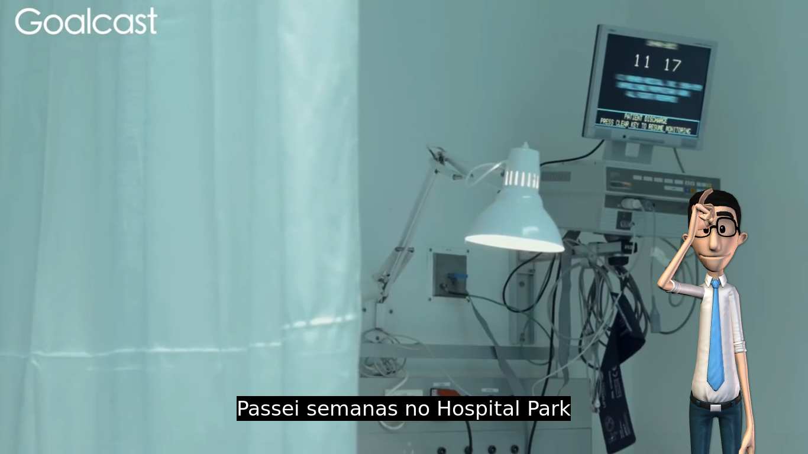

# LanCap - Tradutor de vídeos para Libras

## Resumo
O LanCap é um software open source, criado para legendar vídeos para libras e português. Usando equações matemáticas, o sofware consegue reconhecer falas em um áudio, assim excluíndo ruídos e som ambiente. Após reconhecer as frequências com fala e calcular o tempo de fala limite, as frequências são compactadas em FLAC e enviado para Google Cloud Console. Usando Deep Learning com Speech-To-Text(API) para reconhecimento do texto contido nas frequências, o retorno da Google Cloud é processado baseado no tempo de fala salvo anteriormente e compactado em srt(arquivos de legendas). No final as legendas são enviadas para a Hand Talk(API), com o retorno do personagem 3D é renderizado no vídeo.

## Vídeo demonstrativo
[](https://www.youtube.com/watch?v=7qWeG6pOeDE)

### Requisitos
- Python>=3
- pip>=3
- Apache - qualquer versão
- Linux(ainda)
- FFmpeg

## Instalação, Tecnologias e Depedências
**No desenvolvimento foi utilizado o Python3, com o linux mint 19.2**
- uname -a:
```
Linux joandeson 4.15.0-46-generic #49-Ubuntu SMP Wed Feb 6 09:33:07 UTC 2019 x86_64 x86_64 x86_64 GNU/Linux
```

### Depedências
#### Bibliotecas do Python
```
python3 -m pip install -r requerimentos.txt
```
#### FFmpeg
[Artigo ensinando como instalar](https://www.edivaldobrito.com.br/como-instalar-o-ffmpeg-no-ubuntu/)
```
sudo add-apt-repository ppa:kirillshkrogalev/ffmpeg-next
sudo apt-get update
sudo apt-get install ffmpeg
```

### Tecnologias
- [Google Speech-To-Text](https://cloud.google.com/speech-to-text/)
Conversão de fala em texto baseada em aprendizado de máquina e disponível para áudio de formato curto ou longo.

- [Google Cloud Translate](https://cloud.google.com/translate/)
O Cloud Translation oferece uma API que usa modelos pré-treinados e a capacidade de criar modelos personalizados específicos às suas necessidades, usando a Tradução AutoML.

- [FFmpeg](https://ffmpeg.org/)
Uma solução completa e multiplataforma para gravar, converter e transmitir áudio e vídeo.

- [Hand Talk](https://www.handtalk.me/)
API para tradução de sites que traz acessibilidade digital em Libras para a comunidade surda e seu Aplicativo quebra a barreira de comunicação que há entre ela e os ouvintes. As soluções buscam democratizar o acesso à informação e à comunicação, sendo complementares ao trabalho dos intérpretes de Libras.

### Google Cloud
Google Cloud Platform é uma suíte de computação em nuvem oferecida pelo Google, funcionando na mesma infraestrutura que a empresa usa para seus produtos dirigidos aos usuários, dentre eles o Buscador Google e o Youtube.
Juntamente com um conjunto de ferramentas de gerenciamento modulares, fornecem uma série de serviços incluindo, computação, armazenamento de dados, análise de dados e aprendizagem de máquina.

Acesse: [Google Cloud](https://console.cloud.google.com)

1. Faça uma conta no Google Cloud.
2. Ative a API Speech-To-Text e Translate em seu console da Google Cloud.
3. Insira sua key da Google Cloud no arquivo credenciais.json na chave 'apiKeyGoogleCloud'.
4. Crie uma autenticação de API no Google Cloud, [Artigo ensinado](https://cloud.google.com/video-intelligence/docs/common/auth?hl=pt-br), baixe sua atenticação em json, e copie seu conteúdo para o arquivo credenciais.json.

### Hand Talk
Fundada em 2012, a Hand Talk realiza tradução digital e automática para a Língua Brasileira de Sinais, por meio de dois produtos principais:

Seu Tradutor de Sites traz acessibilidade digital em Libras para a comunidade surda e seu Aplicativo quebra a barreira de comunicação que há entre ela e os ouvintes. As soluções buscam democratizar o acesso à informação e à comunicação, sendo complementares ao trabalho dos intérpretes de Libras.

A empresa, premiada internacionalmente e referência no segmento, é comandada por um simpático intérprete virtual, o Hugo, um personagem 3D que torna a comunicação interativa e de fácil compreensão.

Antes de tudo preciso elogiar a equipe do Hand Talk, nunca vi uma empresa tão prestativa com os seus desenvolvedores, o suporte da Hand Talk é surreal, em menos de 5 minutos eles respondem a pergunta sempre com ótimas soluções. E principalmente quando entrei em contato relatando sobre meu interesse acadêmico para com sua API, mesmo sendo uma API feita para empresas com um valor relativamente alto, a Hand Talk me possibilitou usar sua API para o desenvolvimento, conclusão e coleta de resultados. 

Nesse exemplo usei a API Trial de 15 dias, já que a API do [VLibras](http://www.vlibras.gov.br/) esta fora do ar nesta data de escrita do artigo, dia 04/04/2019 as 23:49m. Para criar uma conta você precisa entrar em contato com a equipe pedindo acesso a sua plataforma usando o trial. Acesse [Hand Talk](https://handtalk.me/).
Após a criação da sua conta, configure conforme dito no parágrafo '[Ren
derização](https://github.com/joandesonandrade/lancap/blob/master/README.md#renderização)', copie seu token para o arquivo credenciais.json na chave 'apiHandTalk'.

## Executando o programa
Após a instalação das depedências e configurações execute o programa usando o seguinte comando:
```
python3 lancap.py <local_do_video/nome_do_video.mp4>(É recomendado copiar o vídeo para dentro da pasta do programa e executar somente com o <nome_do_video.mp4>)
```

## Renderização
A API do Hand Talk por limitações e questões de segurança só permite o acesso através de um domínio verificado na plataforma da sua conta. Exemplo: eu tenho um domínio joandeson.ufpb.br, quando configuro minha API somente esse domínio terá um resultado válido da API, mas para teste é possível criar um domínio local. subindo apache simples, você poderá através do arquivo de sistema hosts apontar o DNS para seu localhost. [Artigo ensinando como criar um domínio local](https://support.rackspace.com/how-to/modify-your-hosts-file/)(use domínios não existente, você pode precisar do domínio um dia,tipo google.com rs). após o processo de criação do domínio, registre o domínio na sua plataforma [Hand Talk](http://account.handtalk.me/) e copie a pasta criada no processo citado em '[Executando o programa](https://github.com/joandesonandrade/lancap/blob/master/README.md#executando-o-programa)' para a pasta apache do seu domínio localhost, acesse o video.html, agora veja o resultado.

## Considerações
O projeto foi pensando para ser renderizado em formato de vídeo MP4, porém pelo fato da Hand Talk API ser um software privado tive limitações, então com Hand Talk API ficou inviavél concluir tal objetivo, porém novos estudos podem melhorar e tornar a idéia inicial possível, por outro lado consegui renderizar o vídeo em HTML5, ou seja o programa funciona como um programa voltado para [Web Service](https://www.opensoft.pt/web-service/). No final do processo de renderização é criado uma pasta no local video/<nome_do_video>/ esta pasta contém todos os arquivos nescessarios para renderizar o vídeo.

## Resultado
Como resultado de muito testes obtive os seguintes resultados em relação ao software LanCap, os resultados de reconhecimento de frequência de fala, obtive um erro segnificativo de 70%, onde quando houver uma oscilação brusca na frequência comparado com o resultado oriundo da média de energia das falas, o software tem dificuldade de reconhecer esses pontos de oscilação brusca como região de fala, um exemplo é quando uma fala é dita de forma rápida, baixa, quebrando totalmente a lógica de média de frequência, processando a fala como se fosse um ruído ou som ambiente. No processo tradução simultânea de inglês para português um coerência de acerto textual foi de 60%, o motivo obvio é que infelizmente a API de Deep Learning da Google Cloud tem muito a aprender em questão de tradução [como foi citado nesse artigo no site oficial da Google Cloud](https://cloud.google.com/translate/), em relação a compreensão e extração das falas do aúdio foi muito excelente cerca de 92% de acerto, resultados fantástico, o resultado final foi de 80% de acerto dos 10 vídeos testados. Assim confirmo que a aplicação das APIs para esses fins é muito viável, precisamos aplicar mais conhecimento neste projeto e torna-lo o mesmo mais eficaz, assim possibilitando em uso diversos tornando as informações mas acessivéis as pessoas com deficiência.

## Referências
- [Hand Talk | Sobre](https://www.handtalk.me/sobre)
- [FFmpeg no Ubuntu: veja como instalar esse pacote no 14.04/14.10 via repositório](https://www.edivaldobrito.com.br/como-instalar-o-ffmpeg-no-ubuntu/)
- [Cloud Speech-to-Text - Speech Recognition  |  Cloud Speech-to-Text API](https://cloud.google.com/speech-to-text/)
- [Cloud Translation API - Dynamic Translation  |  Translation API](https://cloud.google.com/translate/)
- [FFmpeg](https://ffmpeg.org/)
- [Como autenticar em um serviço da Cloud API](https://cloud.google.com/video-intelligence/docs/common/auth?hl=pt-br)
- [Web service: o que é, como funciona, para que serve?](https://www.opensoft.pt/web-service/)
